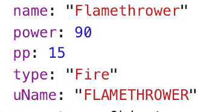

___
# Assignment:
|Trainers|
|:------:|
||
#### Build a PokeDex:
* **Lab**: [URL](https://github.com/mmosayed/PCNW-U4-Lab2)

### Breakdown:
1. Containers:
    * Pokedex: 
        * NavBar
        * Pokemon Index

    * Pokemon Profile:
        * NavBar
        * Tags
        * Moves

2. Components:
    * NavBar: Contains searchBar component
    * Tags: For pokemon types
    * PokeIndex:
    * Search Bar:
    * Moves: A Button component

___

# Resources:

### *CSS:* 
*  **NES** - [GitHub](https://nostalgic-css.github.io/NES.css/)
*  **Bootstrap** - [Web](https://getbootstrap.com/) / [GitHub](https://github.com/twbs/bootstrap) / [NPM](https://www.npmjs.com/package/bootstrap)
* **~~React Materialize~~**  - [GitHub](https://react-materialize.github.io/#/) / [NPM](https://www.npmjs.com/package/react-materialize)

### *REACT Resources:*

*  **Lifecycle** - [URL](http://projects.wojtekmaj.pl/react-lifecycle-methods-diagram/)
*  **Events** - [URL](https://reactjs.org/docs/events.html)

### *Schedule:*

* **Trello** - [URL](https://trello.com/invite/b/UAptvJuA/c445281bba07bf3beabd04cff5a3975b/pokedex)

___
### _**main.js:**_
Primary functions

1. **Function type: _PROMISE_**: `getPokemonData(name)`: takes a pokemon _*name*_ `string` and returns json response containing pokemon data

2. **Function type: _PROMISE_**: `buildPokemon(name)`: takes a pokemon _*name*_ `string` *OR* a *data* from `getPokemonData(name)` and returns a pokemon object which should be stored in state.pokemon. Note '_data_' should be extracted from `getPokemonData(name)` response when passed into buildPokemon using (`response.data`)

3. **Function type: _PROMISE_**: `buildMove(name)`: takes a move *_name_* and returns an object containing the move's properties. This object should be stored in state.moves with the key name being the move name itself (lowercase)

*Other functions are mostly helpers for above functions*

#### *Examples:*

|Function Name|Invocation Example| Returns |
|:------------- |:-------------:| -----:| 
|`buildPokemon(name)`|  | |
|`buildMove(name)` | |  | 

#### *Pokemon Object Breakdown*:

|Key | Image | Note|
|:---|:----:| ---:|
|Sprites|  | Array will be greater than 4 if pokemon has female sprite versions, *ex*: 'Butterfree'|
|Stats|  | Stats will always follow this order (HP, Attack, Defense, Sp.Attack, Sp.Defense, Speed). Each index contains an object with the name of the stat and base_stat value|

___

## *Pokemon Profile Page Grid Breakdown*

___
### Collaborators

*  **Heri** - [GitHub](https://github.com/HeribertoUroza)
*  **Van** - [GitHub](https://github.com/vantran23)
*  **Rob** - [GitHub](https://github.com/FiveEightyEight)